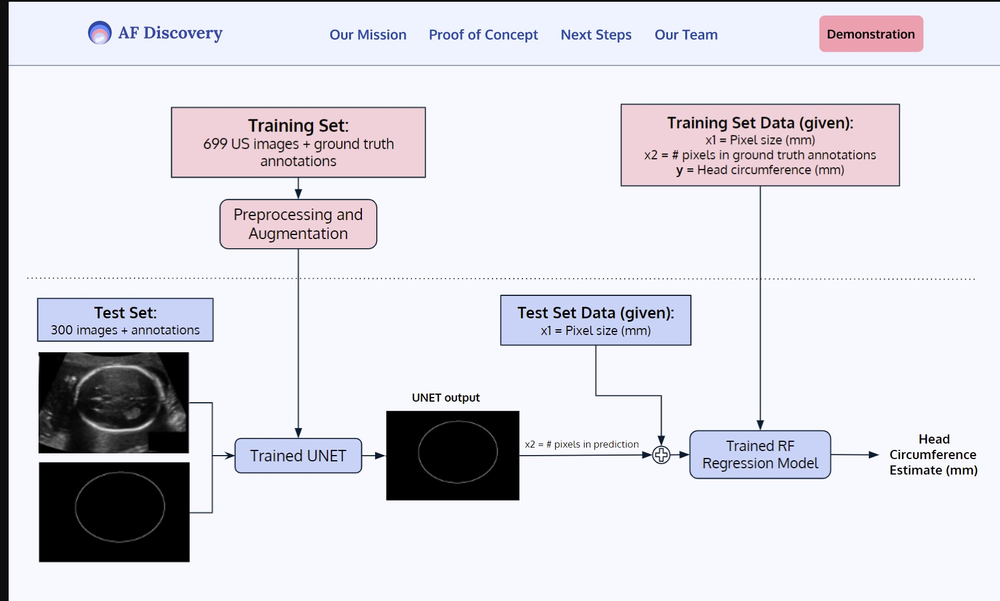
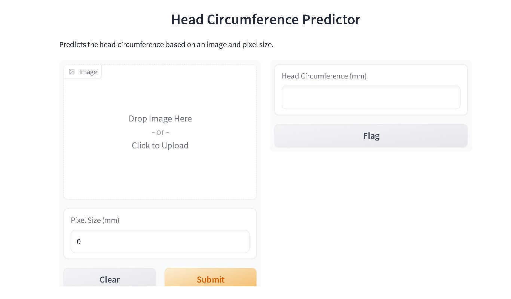

# AF Discovery -- Segment Ultrasound (US) Images for Amniotic Fluid (AF)" -- an AI4GoodLab 2023 Project
This repository contains the code and documentation for the team **AF Discovery** as part of the **AI4GoodLab** 2023. We, a team of five, and our TA, completed this project in 3 weeks. The technical desciption is *"Machine Learning Pipeline to segment Ultrasound (US) images for Amniotic Fluid (AF)"*.

## Overview

## Our Pitch
We’re team **AF Discovery**, and we’re going to show you how we can improve patient care for expecting mothers by helping clinicians make important, time-sensitive decisions with confidence, with the help of our machine learning solution. 

## Why **AF Discovery** matters
When a fetus is being developed in the womb, it’s surrounded by amniotic fluid. Having too much or too little amniotic fluid is both concerning and needs time-sensitive care. 

For example, if the amniotic fluid volume, or AFV, is too low, this may lead to complications with the development of the fetus, and so patients might have to make the time-sensitive decision to undergo induced labour or C-section. 
Over 280 million women deal with complications due to AFV annually, so it’s very important to have accurate measurements of it periodically.

However, AFV needs to be calculated manually. Ultrasound technicians and even doctors themselves need to calculate it from the live ultrasound each time. This takes lots of time, and is a subjective assessment prone to error and biases. Especially in low-resource settings, doctors often don’t have the time to do proper calculations every time, and simply evaluate it visually. 

That’s where we come in. At AF Discovery, we’ve developed a machine learning model to segment fetal ultrasound images and determine the AFV in real-time. This would save doctors time and resources, while empowering patients to make decisions they’re confident in.

## Our development and training process
We’ve trained our supervised deep learning convolutional neural network model called U-NET to segment 2D fetal ultrasound images, and developed a regression model to return predicted outcomes.

We couldn’t get access to a dataset of labelled AFV ultrasound images, but we were able to find a very similar dataset of fetal head ultrasound images. So we trained our UNET model using this fetal head ultrasound dataset, split into labelled training and test datasets. We then trained the regression model using clinical measures that came with the images in the training set. 
This fetal head pipeline would be easily transferable to an AFV dataset!

Our fetal head images were annotated for fetal head circumference and then preprocessed as they were loaded into our UNET model. Following that, the regression model uses the UNET’s segmentation predictions to estimate the outcomes associated with each fetal head image - so it would predict the fetal head circumference. 

## Our model performance
Though our model was able to segment fetal head US images, there is room for improvement. Various similarity coefficients indicated that our prediction accuracy could be higher. Our next steps include improving our model and transfering it to an AF dataset.

## How to use our AF Discovery WebApp
Users would simply upload screenshots of their ultrasound image, and then receive the predicted results of AFV within just a few moments. This could even be adapted to work with live videos, in real-time with ultrasound software, and segment even more ultrasound features in the future! 

## Contact our team
Our team at AF Discovery consists of highly specialized and educated researchers with backgrounds in machine learning, computer science, and biology. We'd be happy to answer any questions you may have!

- Arfaa Rashid
  - B.Sc. in Computer Science at the University of Windsor
  - LinkedIn: [Arfaa's LinkedIn](https://www.linkedin.com/in/arfaa-rashid-6696-hbc/)
  - GitHub: [Arfaa's Github](https://github.com/arfaamr)

- Ann-K Chou
  - M.Sc. in Interactive Arts & Technology from Simon Fraser University
  - LinkedIn: [Ann-K Chou's LinkedIn](https://www.linkedin.com/in/annkchou/)
  - GitHub: [Ann-K Chou's GitHub](https://github.com/annkchou)

- Huma Noor
  - B.Sc. in Biochemical Biophysics and Bioethics from University of Toronto

- Mehjabin Rahman
  - M.Sc. at Toronto Metropolitan University

- Seida Ahmed
  - M.Sc. at University of Toronto
  - GitHub: [Seida Ahmed's GitHub](https://github.com/SeidaAhmed)

- Karissa Chan (Teaching Assistant)
  - M.Sc. at Toronto Metropolitan University
  - LinkedIn: [Karissa Chan's LinkedIn](https://www.linkedin.com/in/karissa-chan/)

---

## Presention and Demo
You can access the presentation and demo of our project [here](https://www.figma.com/proto/LetYxHdyqilbbD0F1KBtLf/AF-Discovery?type=design&node-id=2-2313&scaling=scale-down&page-id=0%3A1&starting-point-node-id=9%3A6275).

## Demo of HC Predictor (gradio app) (live until Jun 20, 2023)

You can access the demo HC Predictor (Random forest regression) [here]
https://9cc7148ac18b49fbb0.gradio.live/     

## Technologies Used
- Machine learning backbone: TensorFlow
- GPU of Collab
- IDE: Collab, Jupyter, Spyder
- Code sharing: Collab, Google Shared Drive, GitHub
- Serverless setup
- Mock-up with Figma
- Front-end deployment with Gradio

## Dataset
We would like to acknowledge and utilize the dataset provided by Thomas L. A. van den Heuvel, Dagmar de Bruijn, Chris L. de Korte, and Bram van Ginneken in their publication titled "Automated measurement of fetal head circumference using 2D ultrasound images" [Data set]. This dataset, available at Zenodo (http://doi.org/10.5281/zenodo.1322001), served as a valuable resource for training our machine learning models. 

## References
- Thomas L. A. van den Heuvel, Dagmar de Bruijn, Chris L. de Korte, and Bram van Ginneken. Automated measurement of fetal head circumference using 2D ultrasound images [Data set]. Zenodo. http://doi.org/10.5281/zenodo.1322001
- arXiv:2303.07852 [eess.IV] https://doi.org/10.48550/arXiv.2303.07852

## Acknowledgements
I (Ann K. Chou) would like to acknowledge AI4Good for their support and guidance throughout this project. Additionally, I would like to express my gratitude to the AI4Good lab for fully supporting my special needs as a person with a disability.

---

## Ann K Chou's Background as Relevant to AI4Good
As a soon-to-graduate Master of Science student in Interactive Arts and Technology at Simon Fraser University, my background is highly relevant to this health-related AI4Good project. With a background as a medical technologist and health informatics practitioner, I bring a unique perspective to the table. Additionally, I am severely hard of hearing and have recently been diagnosed with Autism Spectrum Disorder. These personal experiences have fueled my passion for using technology and AI for the greater good. Joining the AI4Good lab provides me with an opportunity to enhance my technical skills and stay up-to-date with the latest machine learning concepts. Through my own research in electronic health records, I have shifted my focus towards an art-oriented activist community approach and empathy-driven design. This change is partly influenced by the challenges in accessing clinical data and the shifting priorities in the clinical realm due to the impact of COVID-19. This project duration of 3 weeks strikes a good balance for me, allowing me to take care of myself and other obligations while still dedicating time to learning and working on the project.

## Ann K Chou's Individual Contribution
My main contributions to the project were focused on the downstream tasks of the UNet model. I worked on post-processing techniques to refine the output of my colleague's UNet model, which was in the form of a binary image. Additionally, I developed regression models to predict the head circumference based on the segmented ultrasound images. These efforts were crucial in providing accurate and meaningful outcomes for our machine learning solution. I am proud to have played a role in enhancing the performance and usability of our model.

Connect with me:
- 
- 
- 

## Seida Ahmed's Individual Contribution 
My involvement in this project begins with the initiation of the idea, derived from my personal experience.. While pregnant with my first baby, I faced the challenge of low Amniotic Fluid Volume during the third trimester, leading to an elective Cesarian Section. The inconsistent results from various check-ups made it difficult for me to make an informed decision. This made me realize that many women worldwide may face similar problems. Moreover, the limited availability of physicians in Ethiopia further highlighted the need for automation in measuring amniotic fluid levels, allowing doctors to save more lives.

## Arfaa Rashid's Individual Contribution 
- train unet, custom dataloader, similarity, working w dataset
- to be updated..
